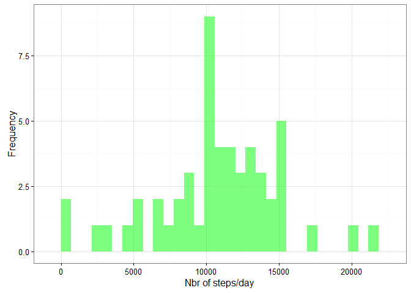
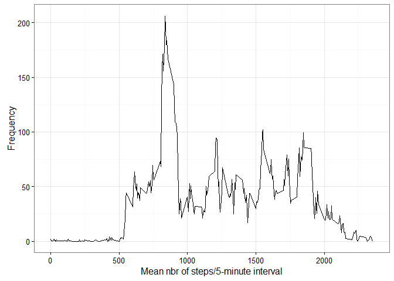
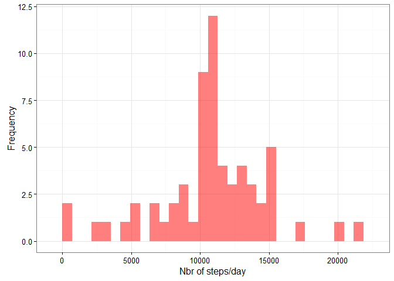
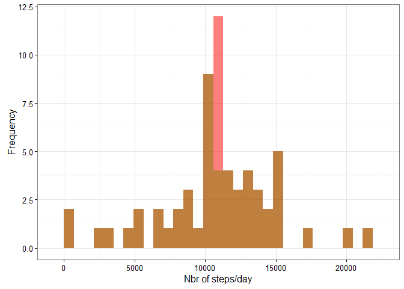
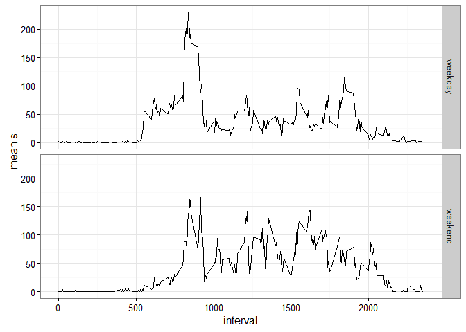
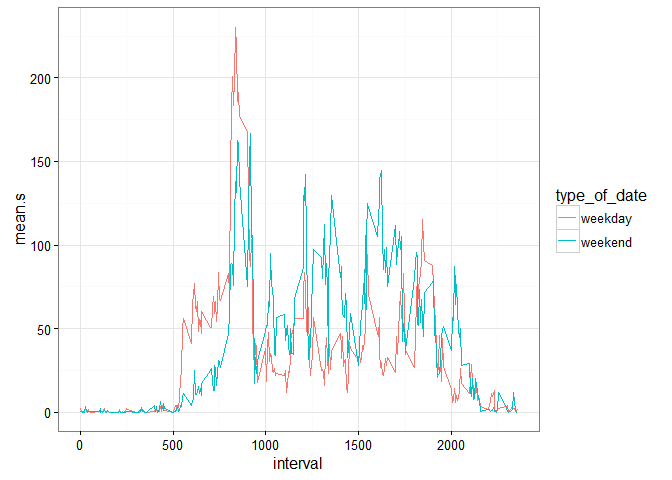

# Reproducible Research: Peer Assessment 1


## Loading and preprocessing the data
First we'll start by loading all the libraries we may need.

```r
library(dplyr)
library(ggplot2)
```

```
## Warning: package 'ggplot2' was built under R version 3.2.3
```

```r
library(readr)
library(lubridate)
```
Next, let's read in the data. Note that we use the `readr` package to do so -it reads CSVs much faster compared to the base R functionality.

```r
df<-read_csv(file="data/activity.csv")
```
## What is mean total number of steps taken per day?
First, let us examine the mean and median of the total number of steps per day.

```r
df.complete<-df[complete.cases(df),]
df.steps<-df.complete %>%
  group_by(date) %>%
  summarise(sum.s=sum(steps,na.rm=T))
mean(df.steps$sum.s,na.rm=T)
```

```
## [1] 10766.19
```

```r
median(df.steps$sum.s,na.rm=T)
```

```
## [1] 10765
```
Now, let's create the histogram that shows the distribution of the number of steps, summed per day.

```r
ggplot(df.steps,aes(x=sum.s))+geom_histogram(fill="green",alpha=0.5)+theme_bw()+xlab("Nbr of steps/day")+ylab("Frequency")
```

```
## `stat_bin()` using `bins = 30`. Pick better value with `binwidth`.
```



## What is the average daily activity pattern?
Now, let's make a time series plot of the 5-minute interval and the average number of steps taken, averaged across all days.

```r
df.time<-df.complete %>%
  group_by(interval) %>%
  summarise(mean.s=mean(steps,na.rm=T))
ggplot(df.time,aes(x=interval,y=mean.s))+geom_line()+theme_bw()+xlab("Mean nbr of steps/5-minute interval")+ylab("Frequency")
```


We can easily find which time interval contains the maximum average number of steps, as follows:

```r
df.time$interval[which.max(df.time$mean.s)]
```

```
## [1] 835
```
## Imputing missing values
We evaluate the number of rows that have an NA value.

```r
sum(!complete.cases(df))
```

```
## [1] 2304
```
Now, let's fill up those missing values. The strategy doesn't have to be sofisticated. I've chosen to replace the missing value by the mean number of steps for the corresponding interval.

```r
#replace NAs
df.edit<-df
df.edit$steps<-sapply(1:nrow(df.edit),function(x){
  if(is.na(df.edit$steps[x])){
    val<-df.time$mean.s[df.time$interval==df.edit$interval[x]]
  }else{
    val<-df.edit$steps[x]
  }
  return(val)
})
```
Now that we've replaced the missing values, let's check to ensure there are no NAs anymore.

```r
sum(!complete.cases(df.edit))
```

```
## [1] 0
```
Great! Our problem is solved.
Calculate and report the mean and median total number of steps taken per day:

```r
df.steps.edit<-df.edit %>%
  group_by(date) %>%
  summarise(sum.s=sum(steps,na.rm=T))
mean(df.steps.edit$sum.s)
```

```
## [1] 10766.19
```

```r
median(df.steps.edit$sum.s)
```

```
## [1] 10766.19
```
The mean and median now coincide compared to part 1, where this was not the case. Now, let's revisit the histogram we created earlier, this time with the replaced NAs.

```r
df.time.edit<-df.edit %>%
  group_by(interval) %>%
  summarise(mean.s=mean(steps,na.rm=T))
ggplot(df.steps.edit,aes(sum.s))+geom_histogram(fill="red",alpha=0.5)+theme_bw()+xlab("Nbr of steps/day")+ylab("Frequency")
```

```
## `stat_bin()` using `bins = 30`. Pick better value with `binwidth`.
```


There is a difference between both histograms, namely when the number of steps/day are just higher than 10000. This becomes more apparent when combining more histograms.

```r
ggplot(df.steps,aes(sum.s))+geom_histogram(fill="green",alpha=0.5)+geom_histogram(data=df.steps.edit,fill="red",alpha=0.5)+theme_bw()+xlab("Nbr of steps/day")+ylab("Frequency")
```

```
## `stat_bin()` using `bins = 30`. Pick better value with `binwidth`.
## `stat_bin()` using `bins = 30`. Pick better value with `binwidth`.
```



## Are there differences in activity patterns between weekdays and weekends?
We need to create a new variable in the dataset with two levels – “weekday” and “weekend” indicating whether a given date is a weekday or weekend day.

```r
my_weekdays<-c("Mon","Tues","Wed","Thurs","Fri")
df.edit$type_of_date<-ifelse(wday(df.edit$date,label=T)%in%my_weekdays,"weekday","weekend")
```
Next, we should make a panel plot containing a time series plot of the 5-minute interval and the average number of steps taken, averaged across all weekday days or weekend days.

```r
df.week.edit<-df.edit %>%
  group_by(type_of_date,interval) %>%
  summarise(mean.s=mean(steps,na.rm=T))
ggplot(df.week.edit,aes(x=interval,y=mean.s))+theme_bw()+geom_line()+facet_grid(type_of_date ~ .)
```


This plot shows that there is a diference in activity between weekdays and weekends. During the week, the maximum number of steps is attained between 8AM and 9AM. During the weekends, there are multiple peaks between 10AM and 5PM. This difference becomes more apparent by combining both panels.

```r
ggplot(df.week.edit,aes(x=interval,y=mean.s,group=type_of_date,color=type_of_date))+theme_bw()+geom_line()
```


